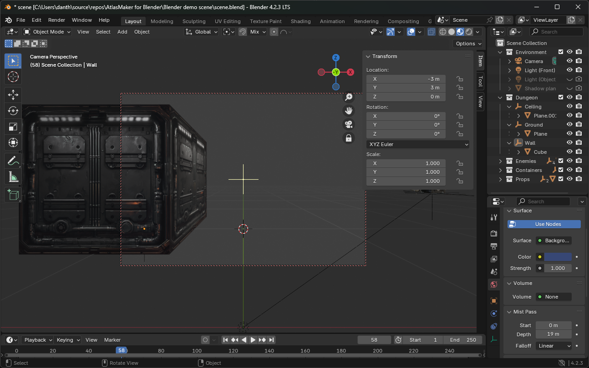
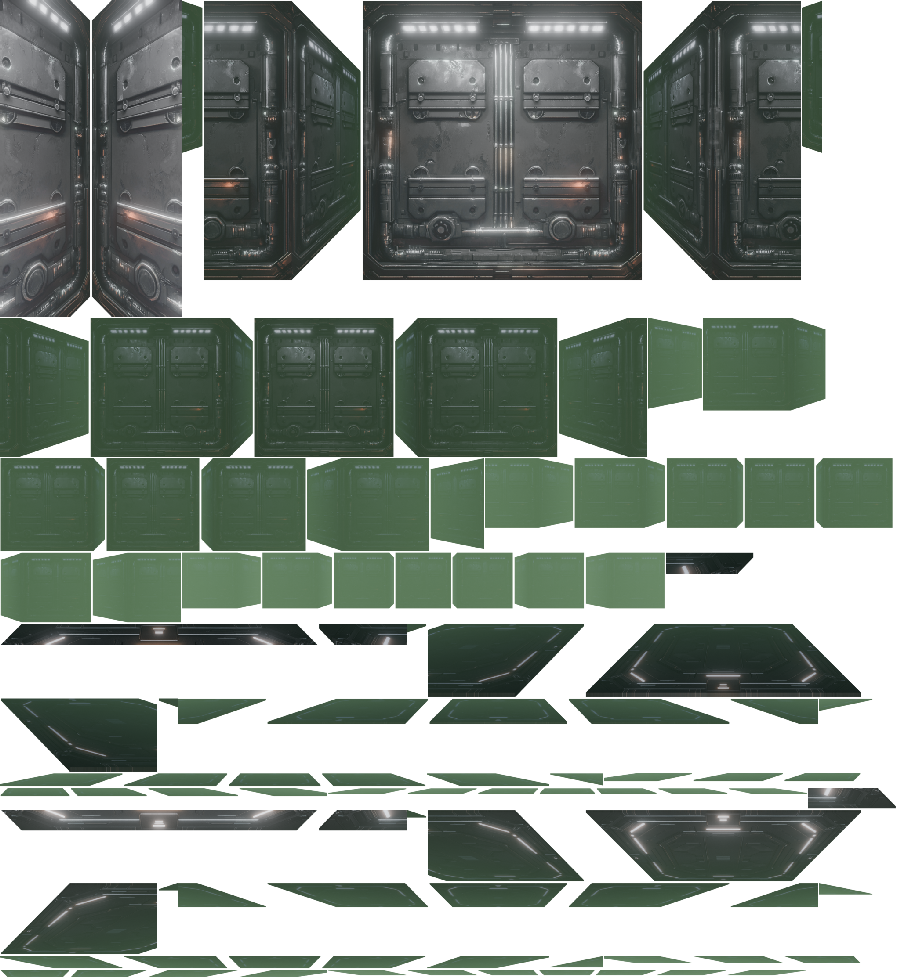

# AtlasMaker-for-Blender
Renders separate images to file, ready to be used in an Image Atlas for making 2D dungeon crawlers.

## Script:
[Blender script](https://github.com/zooperdan/AtlasMaker-for-Blender/raw/refs/heads/main/Blender%20script/render_to_cropped.py)

## How to use
- Download demo scene and script and run it. Output will be lots of individual images that can be combined into an image atlas using [this tool](https://github.com/zooperdan/Make-atlas-from-images).
- Note: Change the output path in the script before you run it.

## Screenshots

